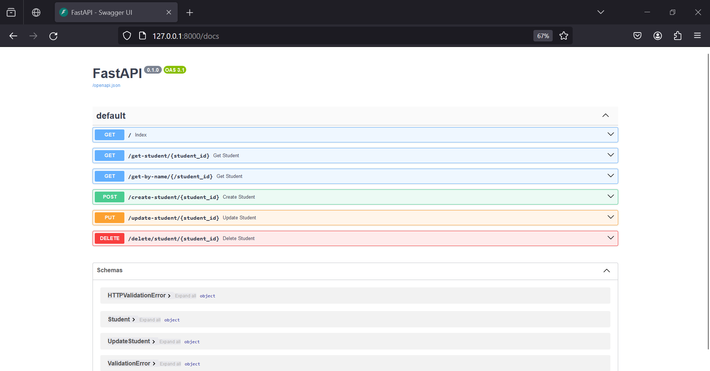

# ⚙️FastAPI CRUD Operations Example

This repository demonstrates basic CRUD (Create, Read, Update, Delete) operations using FastAPI, a modern, fast (high-performance), web framework for building APIs with Python.

## ➡️ Overview

The code provided here illustrates the following concepts of FastAPI:

- **Endpoints**: An endpoint is one end of a communication channel. In this context, it refers to specific URLs in your API.
- **HTTP Methods**: The code implements common HTTP methods:
  - **GET**: Retrieve information or return data.
  - **POST**: Create new data, like adding an object to a database.
  - **PUT**: Update existing data.
  - **DELETE**: Remove data.
- **Path Parameters**: These are parts of the URL that can be used to pass data, specified within curly braces `{}` in the URL.
- **Query Parameters**: These parameters are added to the end of a URL, typically after a `?`, and are used for filtering or pagination purposes.
- **Request Body**: Data passed when creating a new object or data.
- **Pydantic Models**: Pydantic models are used for data validation and serialization. They help define the structure of data passed through the API.

## 📝 Endpoints

### 1. `/get-student/{student_id}` (GET)
   Retrieves information about a student by their ID.

### 2. `/get-by-name/{student_id}` (GET)
   Retrieves information about a student by their name. Allows optional query parameters for filtering.

### 3. `/create-student/{student_id}` (POST)
   Creates a new student with the given ID and provided details in the request body.

### 4. `/update-student/{student_id}` (PUT)
   Updates details of an existing student identified by their ID. Supports partial updates.

### 5. `/delete/student/{student_id}` (DELETE)
   Deletes a student from the database by their ID.

## 📸 Screenshots :
  

## 💻Usage

1. Clone this repository
    ```
    git clone https://github.com/Arpitaagupta/Fast-Api-Basics.git
    ```
2. Install dependencies 
    ```
    python -m pip install fastapi
    ```

    ```
    pip install unicorn
    ```

3. Run the FastAPI server using 
   ```
   uvicorn myapi:app --reload
   ```

4. Access the API endpoints using a tool like Postman or curl.


